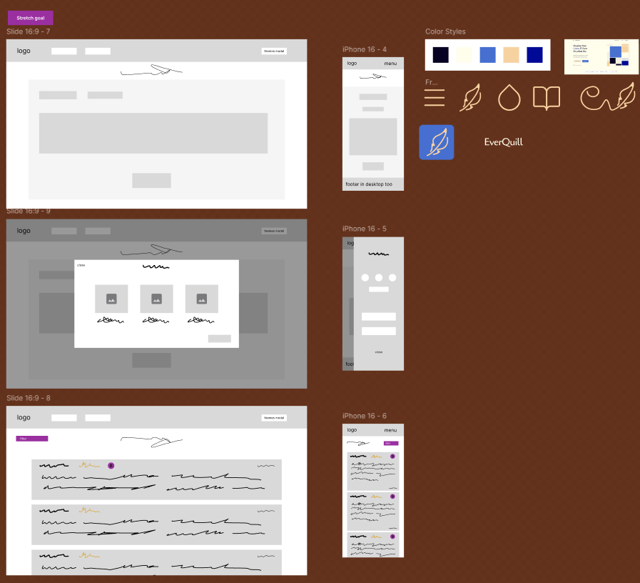
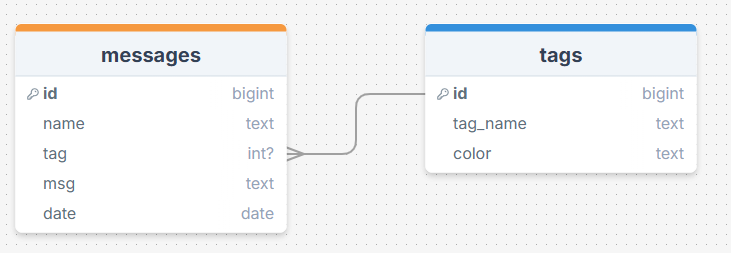

# My Other Work

## Designs

I designed the logo myself, however, the quill icon within it and the other icons are from figma's `Simple Design System` and [IconFinder](https://www.iconfinder.com/icons/11144338/soft_cozy_feather_bird_feather_quill_icon).


## SQL

### Diagrams



### Code

```sql
CREATE TABLE IF NOT EXISTS everquill_tags (
  id       BIGINT PRIMARY KEY GENERATED ALWAYS AS IDENTITY,
  tag_name TEXT NOT NULL,
  color    TEXT NOT NULL
);

CREATE TABLE IF NOT EXISTS everquill_messages (
  id   BIGINT PRIMARY KEY GENERATED ALWAYS AS IDENTITY,
  name VARCHAR(100) NOT NULL,
  tag  INTEGER REFERENCES everquill_tags(id),
  msg  VARCHAR(255) NOT NULL,
  date TEXT NOT NULL
);
```

```sql
INSERT INTO everquill_messages (name, msg, date) VALUES ('Christopher Lee', 'Twice the pride, double the fall.', '13/6/2025'),
('Ian McDiarmid', 'Do it. >:)', '13/6/2025'), ('Ewan McGreggor', 'Hello There', '12/6/2025');
```

# My Self-Reflection

This project felt a lot easier to me than the others, even though i know that's not true. I got to achieve more stretch goals than I have done previously and I have come out learning new quirks and skills; being more proud of the ones I already have as well.

## What Went Well?

- I was able to achieve all the mandatory requirements
- I was able to eachieve some personal stretch goals (i.e. themes)
- I controlled myself when designing in order to not make an overwhelming interface and UX
- I was able to connect to my server multiple times and feel more confident doing so
- I believe I added towards my personal code organisation through style folders and congruent naming conventions
- I did research to find a new-to-me npm package (react-responsive) that I can look foward to using and exploring in the future

## What Didn't Go Well?

- I went over the deadline (┬┬﹏┬┬)
- I did not get to implement layouts for smaller resolutions (though I know what to do)
- I got confused with multiple `useEffect` behaviours
  - [returining an arrow function to clear the interval](./client/src/pages/Write.jsx#L34)
  - [why this onclick breaks unless I do it through useEffect](./client/src/components/Dimmer.jsx#L9-L13)
- I didn't have time to implement or figure out other stretch goals like filters and a delete button
- I didnt get to test tags, or insert any dummy data for them so technically they're unuseable

## What I can Improve on

- working faster
- improving my knowledge so i know what to do so I can work faster
- set more achievable miniature goals so that I can make more manageable progress (ergo, work faster)
